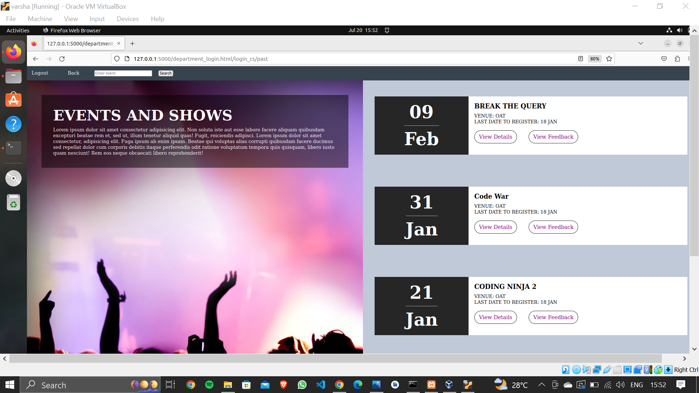
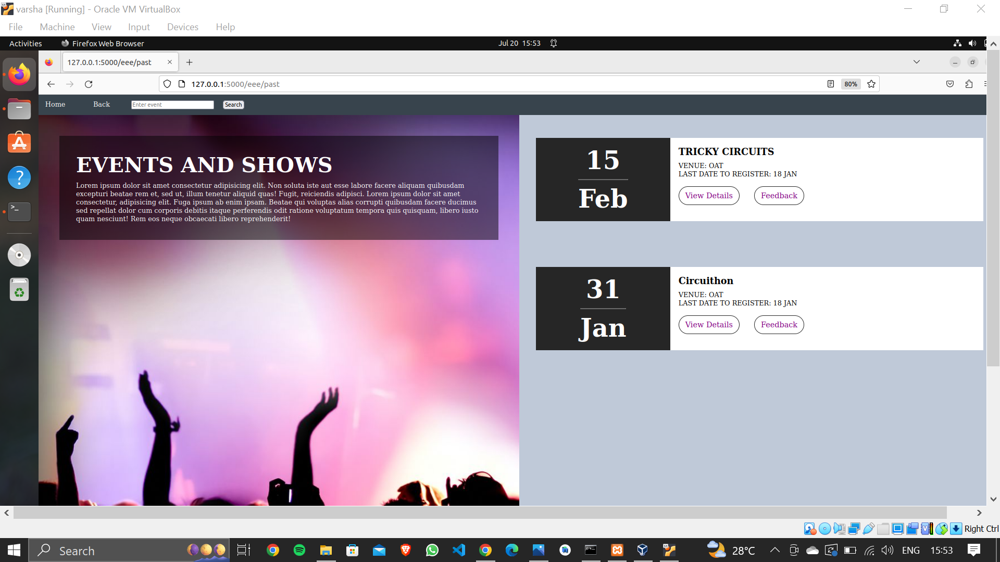
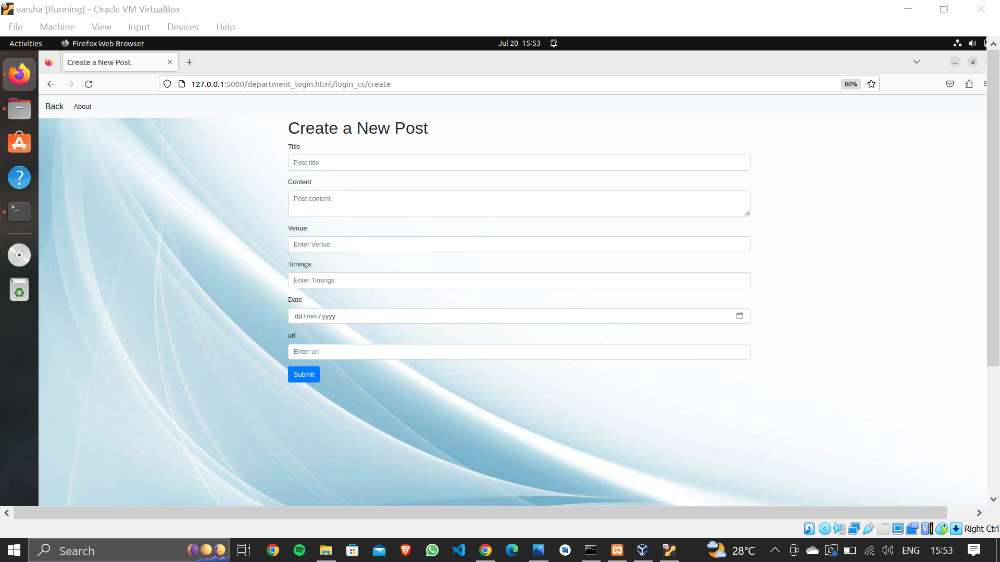
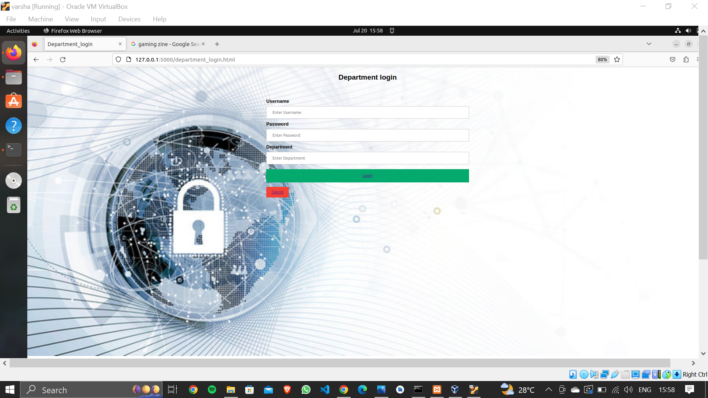
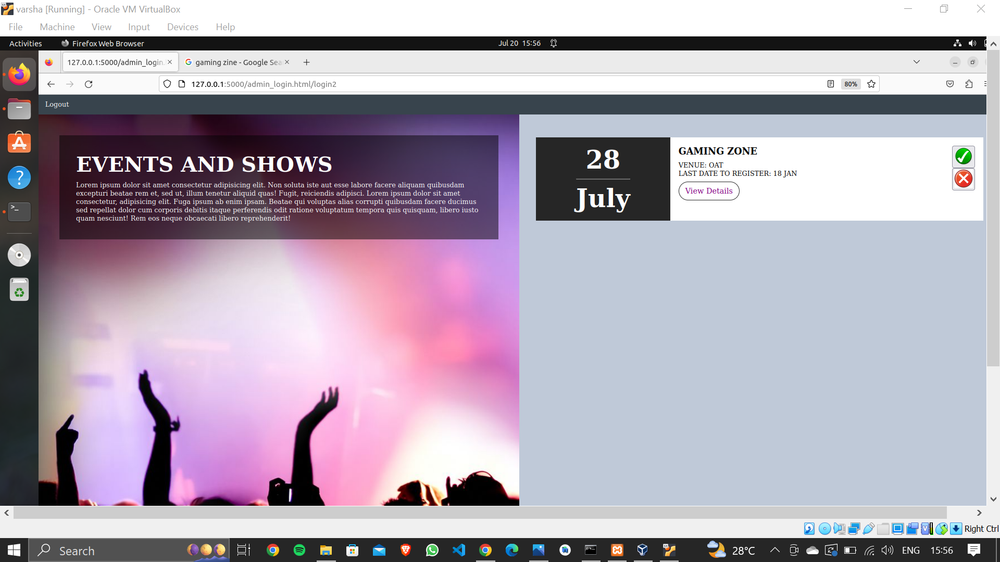

# Event Management Website

## Table of Contents

- [Project Overview](#project-overview)
- [Installation](#installation)
- [Features](#features)
- [Screenshots](#screenshots)

## Project Overview

The Event Management website grants students access to view and obtain comprehensive details about various organization events.
Additionally, students can provide valuable feedback for each event and explore department-wise event listings. 
The website features two distinct logins—one for department heads, enabling them to create, edit, and review posts, including feedback. 
The second login is for the admin, responsible for approving events created or edited by department heads, ensuring a structured hierarchical process.
This system facilitates efficient event management and fosters seamless collaboration among students, department heads, and administrators.

## Installation

1. Download the zip folder.
2. Extract the folder.
3. Go to this location in your linux terminal.
4. create your environment

        $ source env/bin/activate
5. Install flask

        $ pip install flask
6. Run the application

       $ export FLASK_APP=app
       $ export FLASK_ENV=development
       $ flask run

## Features

* Event Discovery: Students can easily find and stay informed about all organization events.
* Department-Wise Listings: Explore events categorized by departments.
* Hierarchy Management: Proper hierarchy ensures streamlined event coordination.
* Feedback Collection: Students can provide valuable feedback for each event.
* Clear Event Details: Access comprehensive event, department, and timing information.
* Event Search: Easily search events by venue and name.

## Screenshots

    Home Page
    
    This page shows all the events in the organization according to the time stamp, recent events first.
    It also have a feature of past events, which shows the past events and the students can rate the event. 
    There is an option of view details, which allows user to know more about any event 

    Department Home Page
    
    This page shows all the events conducted by a particular department.

    Department Login Page
    
    This page allows the department heads to login to their respective account. He can create, 
    edit and also see the feedback given by the students for an event.

    Create Post Page
    
    This is page to create a post by Department head.

     Admin Home Page
    
    Admin is the last level of heirarchy who accepts the requests. Department head creates the post, whenever he 
    creates or edits the request is sent to admin, he has to accept the request, only then it will be visible to the student.

